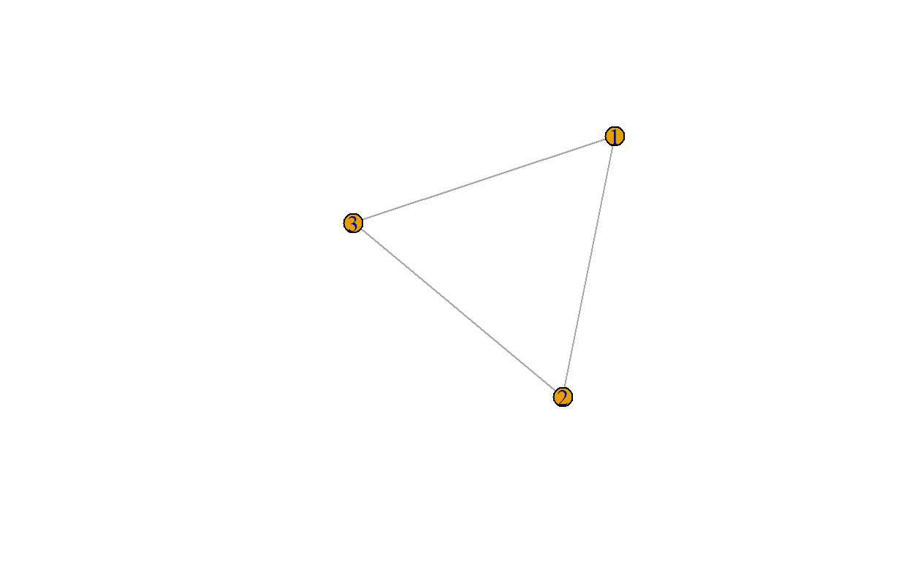
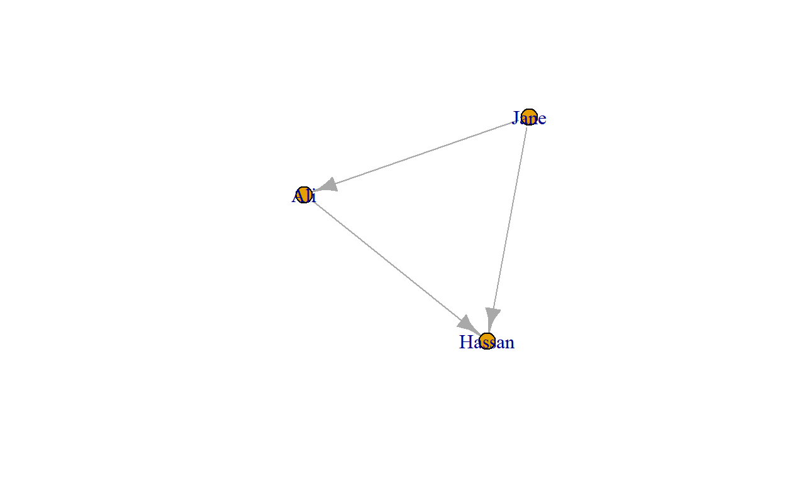
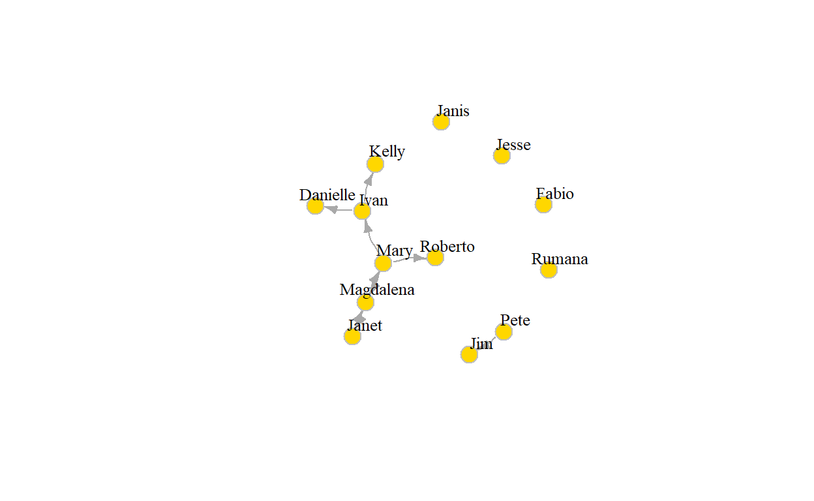

## Introduction
There are two main packages in R to construct network objects. 

__The first is _igraph_.__ The _igraph_ package actually has implementations in
C/C++, Python, Mathematica, and R. Although the _igraph_ functions are slightly
different between these three environments, you will benefit from the code in
this course if you want to use _igraph_ in another environment at a later time.

The general _igraph_ page is [here](https://igraph.org/) and the 
extended documentation for the R version is [here](https://igraph.org/r/#docs).

__The second is the (creatively named) _network_ package.__ This package
implements a class of _network_ objects that can be analyzed by packages such as
_sna_ (these packages are all part of the _statnet_ suite of packages, that all
work together). We will make use of this package a lot as well.

Unfortunately, the _igraph_ and _network_ network objects are not
interchangeable, the objects that you create in _igraph_ can not be used in
_network_/_sna_, and vice versa. This is unfortunate, because these packages
differ in their functionality, so you often might want to combine some _igraph_
functions with some _sna_ functions in a single analysis. Fortunately, but there
are ways to move between the packages by transforming the object to fit the
other package. It is a bit cumbersome, but you will have to be able to do it
nonetheless.

## _igraph_
Let's start with the _igraph_ package.

We can easily create an undirected network and add a few nodes and links. Nodes
are called _vertices_ and referred to by integer IDs; links are called _edges_.


The code below generates an undirected graph with three edges. The numbers are
interpreted as vertex IDs, so the edges are 1–>2, 2–>3, 3–>1.


```r
g1 <- igraph::graph( edges=c(1,2, 2,3, 3, 1), n=3, directed=F ) 
plot(g1)
```



```r
class(g1)
```

```
## [1] "igraph"
```

```r
g1
```

```
## IGRAPH 4656097 U--- 3 3 -- 
## + edges from 4656097:
## [1] 1--2 2--3 1--3
```

As you see, _igraph_ creates a network object of class _igraph_. 


```r
g2 <- igraph::graph( c("Jane", "Ali", "Ali", "Hassan", "Jane", "Hassan")) # named vertices

# When the edge list has vertex names, the number of nodes is not needed
plot(g2)
```



```r
g2
```

```
## IGRAPH 466ee22 DN-- 3 3 -- 
## + attr: name (v/c)
## + edges from 466ee22 (vertex names):
## [1] Jane->Ali    Ali ->Hassan Jane->Hassan
```


Small graphs can also be generated using symbols in the
`igraph::graph_from_literal` function:

* "--" for undirected tie
* "+-" or "-+" for directed ties pointing to the left or to the right
* "++" for a symmetric tie
* ":" for sets of vertices.


```r
g3 <- igraph::graph_from_literal(Mary++Magdalena++Janet, Jim+-Pete, Mary-+Roberto, 
Mary-+Ivan-+Kelly:Danielle, Jesse, Janis, Fabio, Rumana)
plot(g3, edge.arrow.size = .5, vertex.color = "gold", vertex.size = 15, 
     vertex.frame.color = "gray", vertex.label.color = "black", 
     vertex.label.cex = 0.8, vertex.label.dist = 2, edge.curved = 0.2) 
```



```r
g3
```

```
## IGRAPH 4687146 DN-- 13 9 -- 
## + attr: name (v/c)
## + edges from 4687146 (vertex names):
## [1] Mary     ->Magdalena Mary     ->Roberto   Mary     ->Ivan     
## [4] Magdalena->Mary      Magdalena->Janet     Janet    ->Magdalena
## [7] Pete     ->Jim       Ivan     ->Kelly     Ivan     ->Danielle
```
            
This works just fine when you have small networks (or you want to generate some 
simple artificial networks to test your data), but is not feasible for larger 
networks. 


<!--html_preserve-->
<script type="application/shiny-prerendered" data-context="server-start">
library(learnr)
library(gradethis)
# library(magrittr)
tutorial_options(exercise.checker = gradethis::grade_learnr)
knitr::opts_chunk$set(echo = FALSE)
</script>
<!--/html_preserve-->
<!--html_preserve-->
<script type="application/shiny-prerendered" data-context="server">
learnr:::register_http_handlers(session, metadata = NULL)
</script>
<!--/html_preserve-->
<!--html_preserve-->
<script type="application/shiny-prerendered" data-context="server">
session$onSessionEnded(function() {
        learnr:::session_stop_event(session)
      })
</script>
<!--/html_preserve-->
